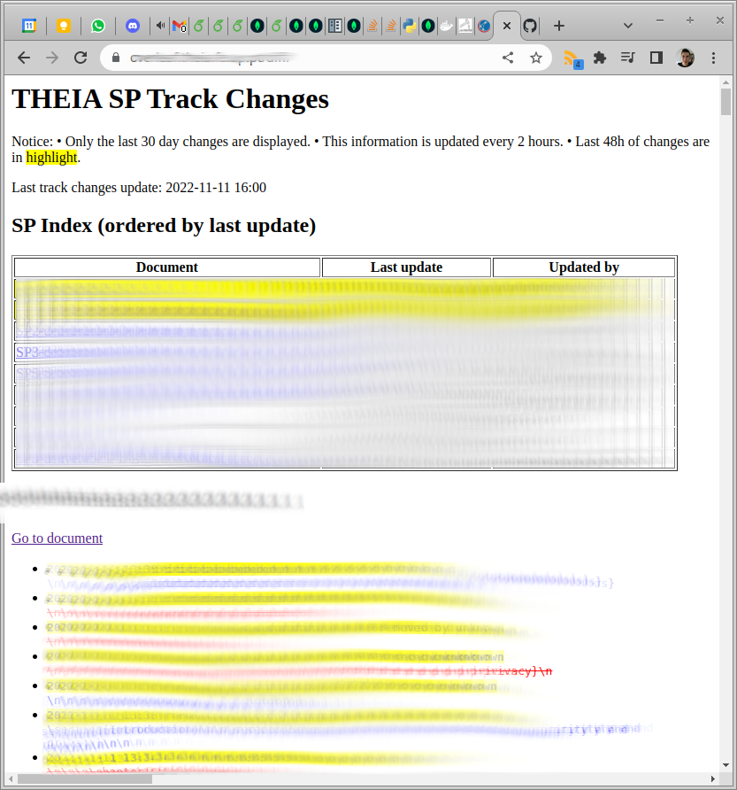

# overleaf-trackchanges-hack
Overleaf community does not have trackchanges. A hack to generate a page for that.

To make it working:

1. Add a docker volume to communicate between the container and the host
    - `nano overleaf-toolkit/lib/docker-compose.nginx.yml`
    - Add to `volumes` a correspondance: `- /hostdir:/containerdir`
    - Naturally, you must create the corresponding directories.
2. Modify nginx to serve your static page
    - `nano overleaf-toolkit/config/nginx/nginx.conf`
    - location /diff { alias /containerdir; autoindex on; }
3. You may want to add a button for your changes in `./services/web/app/views/layout/navbar.pug`
4. Refresh your trackchanges by running the script in this repo to `crontab -e`

